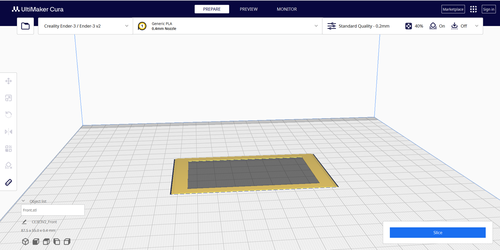

# Study Buddy (Pomogotchi)

## Purpose
A desk device, designed to assist students with focusing on study and work.

## Function
The core function is a combination of the 'pomodoro' technique and the 'Tamagotchi' concept. It is also equipped with various sensors (temperature, humidity, air quality), inputs (SD card, buttons, web connection), outputs (LED display, speaker), and app integrations (e.g. calendar, Spotify), all aimed at creating a better, studying environment.